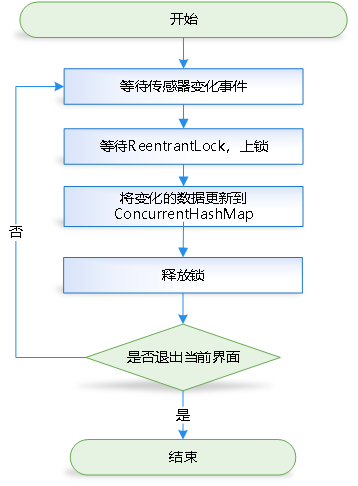
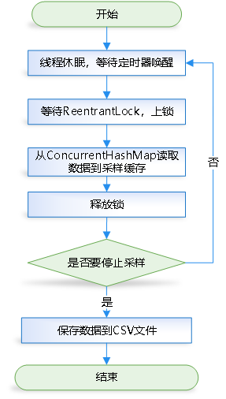
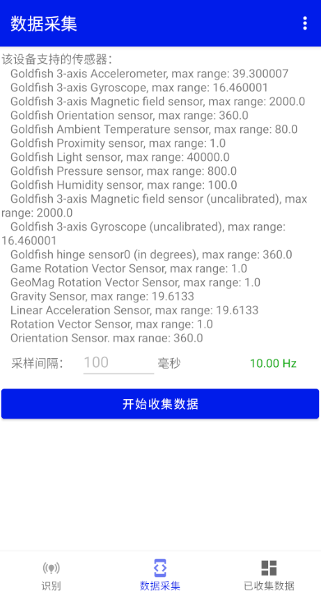

# 安卓姿态传感器数据采集
采集安卓手机使用过程中，以下三种姿态的传感器变化数据：
```python
{
    0: "正常的输入操作",
    1: "输入中换人",
    2: "行走输入"
}
```
包括手机重力感应器、线性加速度感应器、加速度感应器和陀螺仪。用于训练姿态识别模型。 姿态识别模型训练及部署项目见:[Phone_Attitude_Recognition](https://github.com/charent/Phone_Attitude_Recognition)，配合该服务端项目可以进行APP更新、姿态识别回传等。

此项目为`Android Studio` 项目，导入即可使用。


# 技术细节

| 传感器采集线程 | 数据采集线程 |
|---------------|--------------|
|  |  |

# 界面展示
